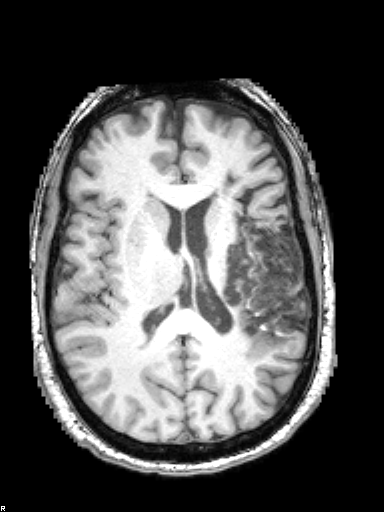
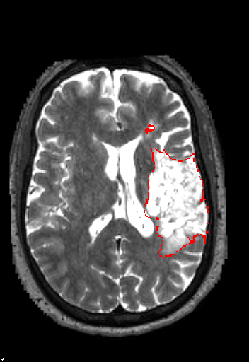
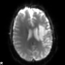
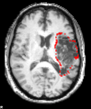
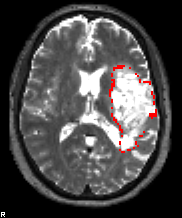
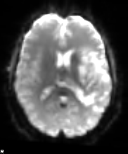
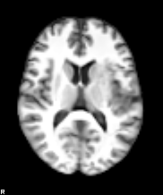

# SYNcro

SYNcro spatially normalizes clinical medical images to match the shape of the [MNI152 template](https://www.bic.mni.mcgill.ca/ServicesAtlases/ICBM152NLin2009). This allows images from different people to be analyzed in a common space. Spatial normalization methods that work reliably with high-resolution T1-weighted scans from healthy adults can fail in clinical populations. Diverse imaging modalities, 2D sequences with thick slices, nuisance features such as scalp fat, and abnormalities such as lesions can all disrupt automated methods. Previous solutions have included [cost function masking](https://pubmed.ncbi.nlm.nih.gov/11467921/) (ignoring the injury), lesion [healing](https://pubmed.ncbi.nlm.nih.gov/18023365/), using [admission modalities that do not yet reveal lesions](https://pubmed.ncbi.nlm.nih.gov/23347558/), and modality-specific templates (for example, [CT](https://pubmed.ncbi.nlm.nih.gov/22440645/) and [FLAIR](https://brainder.org/download/flair/)).

In contrast, SYNcro uses [SynthSR](https://pubmed.ncbi.nlm.nih.gov/34048902/) to generate a uniform, high-resolution T1-weighted image from almost any brain scan. SynthSR tends to fill in lesions in the synthesized image while preserving the geometry of the input. This provides a good target for estimating how the scan must be deformed to match the template.

SYNcro therefore fills an important niche by providing fast, reliable, and robust alignment of clinical images. It is a minimal wrapper around proven tools developed by other teams:

- [SynthSR](https://pubmed.ncbi.nlm.nih.gov/34048902/) converts the input into a high-resolution T1-weighted scan.
- [MindGrab](https://pubmed.ncbi.nlm.nih.gov/42331200/) extracts the brain, preventing scalp fat from influencing registration.
- [Greedy](https://github.com/pyushkevich/greedy) performs nonlinear registration, bending the scan to match the template.
- [niimath](https://pmc.ncbi.nlm.nih.gov/articles/PMC11392019/) performs supporting image and mask calculations.

SYNcro itself is a minimal Python script that coordinates these standalone executables.

## Installation

SYNcro is still experimental. You can try the [web version](https://webapps.neurodesk.org/syncro/) on any operating system. The standalone version is currently available only for Apple Silicon (Arm64) macOS computers.

- Download and install the [latest notarized SYNcro macOS package](https://github.com/rordenlab/SYNcro/releases/latest). Once installed, run `SYNcro` from the command line.

## Tutorials

This repository provides sample datasets illustrating several common uses of the tool. Each example includes a brain injury and assumes that a lesion has been drawn on one of the scans. However, because SynthSR tends to fill in lesions in its synthesized image, a lesion map is not required for normalization and could instead be drawn after normalization. You can also run the same workflow for participants without lesions—for example, to measure false alarms when detecting radiological abnormalities. In either case, simply omit `--lesion MASK` from the SYNcro command.

In the images below, red marks the lesion mask. The mask is stored as a separate
image; it is shown as an overlay here to make its location easy to see.

The command grammar is:

```text
SYNcro ANATOMICAL [--lesion MASK ...] [SCAN [--lesion MASK ...]]... [OPTIONS]
```

The first scan supplies the detailed anatomy used to estimate nonlinear normalization.
Every later scan is rigidly aligned to that anatomical scan. Each `--lesion` (or `-l`)
belongs to the scan immediately before it, so the relationship is explicit even when
several scans and masks are supplied.

### T1w, T2w, lesion, and 4D fMRI

This session demonstrates the general multi-image workflow. The high-resolution T1w
scan supplies the anatomy. The lesion was drawn on the T2w scan, so `--lesion` follows
the T2w filename. The 60-volume BOLD series is a third scan with a much coarser grid.
SYNcro rigidly aligns the T2w and the temporal mean of the BOLD series to the T1w,
then applies one composed transform to every BOLD volume. Note here we are applying the spatial normalization to the raw BOLD image, in practice you would likely undistort your fMRI data using a fieldmap or an image with reversed phase-encoding polarity. The BOLD data are assumed to
have already been motion corrected; SYNcro does not realign individual time points.

#### Complete session at 2 mm

| Input: anatomical T1w | Input: T2w with lesion | Input: mean BOLD |
| --- | --- | --- |
|  |  |  |

| Output: normalized T1w with lesion | Output: normalized T2w with lesion | Output: mean normalized BOLD | Output: normalized synthetic T1w |
| --- | --- | --- | --- |
|  |  |  |  |

```bash
SYNcro \
  tutorial/sub-M2295_ses-239_acq-tfl3p2_run-3_T1w.nii.gz \
  tutorial/sub-M2295_ses-239_acq-spc3p2_run-4_T2w.nii.gz \
  --lesion tutorial/sub-M2295_ses-239_acq-spc3p2_run-4_T2w_desc-lesion_mask.nii.gz \
  tutorial/sub-M2295_ses-239_task-naming40_acq-epfid2_dir-AP_run-2_bold.nii.gz \
  --target tutorial/MNI152_T1_2mm_brain_mask.nii.gz \
  --directory outputs/m2295
```

`--target` chooses the voxel grid for every normalized output. Here it requests a 2 mm
MNI grid (`91×109×91`), which keeps the 4D result much smaller than a 1 mm series. It
does not replace the bundled 1 mm MNI brain used to estimate the anatomical deformation,
and its voxel values are not used. SYNcro preserves the 60 time points and their 10-second
spacing. It writes NIfTI images only; accompanying JSON sidecars are not transformed or
copied.

#### Anatomical scans without the BOLD series

Use this shorter command when only the structural images and lesion are needed. The
lesion follows the T2w because it was drawn in T2w space. With no `--target`, outputs
use SYNcro's default 1 mm MNI grid.

```bash
SYNcro \
  tutorial/sub-M2295_ses-239_acq-tfl3p2_run-3_T1w.nii.gz \
  tutorial/sub-M2295_ses-239_acq-spc3p2_run-4_T2w.nii.gz \
  --lesion tutorial/sub-M2295_ses-239_acq-spc3p2_run-4_T2w_desc-lesion_mask.nii.gz \
  --directory outputs/m2295-structural-1mm
```

This produces normalized T1w, T2w, and lesion images, as well as the normalized
synthetic T1w and brain-extracted original T1w.

#### T1w and 4D BOLD only

A lesion map is optional. This command rigidly aligns the temporal mean of the BOLD
series to the T1w and applies that one alignment to all 60 volumes:

```bash
SYNcro \
  tutorial/sub-M2295_ses-239_acq-tfl3p2_run-3_T1w.nii.gz \
  tutorial/sub-M2295_ses-239_task-naming40_acq-epfid2_dir-AP_run-2_bold.nii.gz \
  --target tutorial/MNI152_T1_2mm_brain_mask.nii.gz \
  --directory outputs/m2295-bold-2mm
```

The normalized series is
`wsub-M2295_ses-239_task-naming40_acq-epfid2_dir-AP_run-2_bold.nii.gz`.
It remains a 60-volume 4D image. Do not place the BOLD image first: the first input must
be a 3D anatomical scan suitable for SynthSR. If a lesion were drawn on a BOLD-derived
image, its 3D mask would follow the BOLD filename and would need to match the BOLD
spatial grid exactly.

#### Choosing output resolution and field of view

Omit `--target` for the bundled 1 mm MNI grid. This gives the finest standard output,
but a 4D series contains about eight times as many spatial voxels as the corresponding
2 mm output:

```bash
SYNcro \
  tutorial/sub-M2295_ses-239_acq-tfl3p2_run-3_T1w.nii.gz \
  tutorial/sub-M2295_ses-239_task-naming40_acq-epfid2_dir-AP_run-2_bold.nii.gz \
  --directory outputs/m2295-bold-1mm
```

Use the supplied target for smaller 2 mm outputs:

```bash
SYNcro \
  tutorial/sub-M2295_ses-239_acq-tfl3p2_run-3_T1w.nii.gz \
  tutorial/sub-M2295_ses-239_task-naming40_acq-epfid2_dir-AP_run-2_bold.nii.gz \
  --target tutorial/MNI152_T1_2mm_brain_mask.nii.gz \
  --directory outputs/m2295-bold-2mm
```

Any 3D NIfTI can serve as the reslicing target, including a cropped MNI-space image
with a smaller field of view:

```bash
SYNcro \
  tutorial/sub-M2295_ses-239_acq-tfl3p2_run-3_T1w.nii.gz \
  tutorial/sub-M2295_ses-239_acq-spc3p2_run-4_T2w.nii.gz \
  --lesion tutorial/sub-M2295_ses-239_acq-spc3p2_run-4_T2w_desc-lesion_mask.nii.gz \
  --target /path/to/cropped_MNI_grid.nii.gz \
  --directory outputs/m2295-cropped
```

SYNcro uses the target's dimensions, voxel size, orientation, and origin; its voxel
values are ignored. A custom target should already describe the intended MNI coordinate
system. The target changes every normalized output from that command, not just the 4D
series. Use a new output directory for each target grid so results cannot be confused.

### TRACE and T1w

This acute scan shows a lesion on the low-resolution diffusion TRACE image before it is visible on the high-resolution T1-weighted image. The lesion was therefore drawn on the TRACE image. SYNcro first aligns the TRACE image and its lesion map to the T1-weighted image, then normalizes all three images to the MNI152 template.

| Input: anatomical T1w | Input: TRACE with lesion | Output: normalized T1w with lesion | Output: normalized TRACE with lesion | Output: normalized synthetic T1w |
| --- | --- | --- | --- | --- |
|  |  |  |  |  |

```bash
SYNcro \
  tutorial/sub-101_T1w.nii.gz \
  tutorial/sub-101_rec-TRACE_dwi.nii.gz \
  --lesion tutorial/sub-101_space-TRACE_desc-lesion_mask.nii.gz \
  --directory outputs/traceAndT1
```

### TRACE only

This example provides only the low-resolution diffusion TRACE scan and its lesion map. SYNcro creates a synthetic T1-weighted image from the TRACE scan and uses it to normalize both inputs to the MNI152 template.

| Input: TRACE with lesion | Output: normalized TRACE with lesion | Output: normalized synthetic T1w |
| --- | --- | --- |
|  |  |  |

```bash
SYNcro \
  tutorial/sub-101_rec-TRACE_dwi.nii.gz \
  --lesion tutorial/sub-101_space-TRACE_desc-lesion_mask.nii.gz \
  --directory outputs/traceOnly
```

### T1w only

This example provides a T1-weighted scan and a lesion map drawn in the same image space. SYNcro creates a more uniform synthetic T1-weighted image, uses it to estimate the normalization, and applies that normalization to both inputs.

| Input: T1w with lesion | Output: normalized T1w with lesion | Output: normalized synthetic T1w |
| --- | --- | --- |
|  |  |  |

```bash
SYNcro \
  tutorial/T1w.nii.gz \
  --lesion tutorial/T1w-lesion.nii.gz \
  --directory outputs/t1Only
```

### CT only

This example provides a CT scan and a lesion map drawn in the same image space. The `--ct` option tells SynthSR that the input intensities are Hounsfield units, allowing it to process the CT appropriately.

| Input: CT with lesion | Output: normalized CT with lesion | Output: normalized synthetic T1w |
| --- | --- | --- |
|  |  |  |

```bash
SYNcro \
  tutorial/CT.nii.gz \
  --lesion tutorial/CT-lesion.nii.gz \
  --directory outputs/ctOnly \
  --ct --keep-synth
```

This example also demonstrates the `--keep-synth` option. It retains the T1-weighted scan created by SynthSR before brain extraction and spatial normalization. This image includes scalp signal and can be inspected or analyzed with tools designed for whole-head T1-weighted scans, such as brain-age methods. The command therefore generates five outputs:

- `wCT.nii.gz`: normalized input CT image
- `wbCT.nii.gz`: normalized, brain-extracted input CT image
- `wCT-lesion.nii.gz`: normalized lesion image
- `t1CT.nii.gz`: synthesized T1-weighted scan before spatial normalization
- `wbt1CT.nii.gz`: normalized, brain-extracted synthetic T1-weighted scan

### Input and reslicing rules

- The anatomical input and lesion masks must be 3D. Other scans may be 3D or 4D.
- A lesion must have exactly the same spatial dimensions and geometry as the scan that
  precedes its `--lesion` option. Multiple lesions may be paired with one scan by
  repeating the option.
- Additional scans need not match the anatomical grid. SYNcro estimates a separate
  rigid-body alignment for each one before composing it with the anatomical-to-MNI
  deformation.
- Continuous scans use linear interpolation. Lesions use nearest-neighbor interpolation
  and are written as binary `uint8` images.
- `--ct` tells SynthSR that the anatomical input is CT and applies CT air-background
  handling to every scalar scan in the command, but never to lesion masks.
- Without `--target`, normalized outputs use the bundled 1 mm MNI grid. A 3D NIfTI
  supplied with `--target` changes the output dimensions, resolution, orientation, and
  field of view for every result.

## References

- [SynthSR](https://pubmed.ncbi.nlm.nih.gov/36724222/)
- [MindGrab](https://pubmed.ncbi.nlm.nih.gov/42331200/)
- [Greedy registration](https://github.com/pyushkevich/greedy)
- [niimath](https://github.com/rordenlab/niimath)
- The `sub-101` images come from the [Stroke Outcome Optimization Project
(SOOP)](https://pubmed.ncbi.nlm.nih.gov/39095364/).
- The `T1` and `T2` scans come from the [clinical toolbox](https://github.com/neurolabusc/Clinical).
- The `CT` image is from the [acute ischemic stroke dataset](https://github.com/GriffinLiang/AISD).
- The MNI152 template is from the [McConnell Brain Imaging Centre](https://www.bic.mni.mcgill.ca/ServicesAtlases/ICBM152NLin2009).
