# SYNcro

SYNcro spatially normalizes clinical medical images to match the shape of the [MNI152 template](https://www.bic.mni.mcgill.ca/ServicesAtlases/ICBM152NLin2009). This allows images from different people to be analyzed in a common space. Spatial normalization methods that work reliably with high-resolution T1-weighted scans from healthy adults can fail in clinical populations. Diverse imaging modalities, 2D sequences with thick slices, nuisance features such as scalp fat, and abnormalities such as lesions can all disrupt automated methods. Previous solutions have included [cost function masking](https://pubmed.ncbi.nlm.nih.gov/11467921/) (ignoring the injury), lesion [healing](https://pubmed.ncbi.nlm.nih.gov/18023365/), using [admission modalities that do not yet reveal lesions](https://pubmed.ncbi.nlm.nih.gov/23347558/), and modality-specific templates (for example, [CT](https://pubmed.ncbi.nlm.nih.gov/22440645/) and [FLAIR](https://brainder.org/download/flair/)).

In contrast, SYNcro uses [SynthSR](https://pubmed.ncbi.nlm.nih.gov/34048902/) to generate a uniform, high-resolution T1-weighted image from almost any brain scan. SynthSR tends to fill in lesions in the synthesized image while preserving the geometry of the input. This provides a good target for estimating how the scan must be deformed to match the template.

SYNcro therefore fills an important niche by providing fast, reliable, and robust alignment of clinical images. It is a minimal wrapper around proven tools developed by other teams:

- [SynthSR](https://pubmed.ncbi.nlm.nih.gov/34048902/) converts the input into a high-resolution T1-weighted scan.
- [MindGrab](https://pubmed.ncbi.nlm.nih.gov/42331200/) extracts the brain, preventing scalp fat from influencing registration.
- [Greedy](https://github.com/pyushkevich/greedy) performs nonlinear registration, bending the scan to match the template.
- [niimath](https://pmc.ncbi.nlm.nih.gov/articles/PMC11392019/) performs supporting image and mask calculations.

SYNcro itself is a minimal Python script that coordinates these standalone executables.

## Installation

SYNcro is still experimental. You can try the [web version](https://webapps.neurodesk.org/syncro/) on any operating system. The standalone version is currently available only for Apple Silicon (Arm64) macOS computers.

- Download and install the [latest notarized SYNcro macOS package](https://github.com/rordenlab/SYNcro/releases/latest). Once installed, run `SYNcro` from the command line.

## Tutorials

This repository provides sample datasets illustrating several common uses of the tool. Each example includes a brain injury and assumes that a lesion has been drawn on one of the scans. However, because SynthSR tends to fill in lesions in its synthesized image, a lesion map is not required for normalization and could instead be drawn after normalization. You can also run the same workflow for participants without lesions—for example, to measure false alarms when detecting radiological abnormalities. In either case, simply omit the lesion image from the SYNcro command.

In the images below, red marks the lesion mask. The mask is stored as a separate
image; it is shown as an overlay here to make its location easy to see.

### TRACE and T1w

This acute scan shows a lesion on the low-resolution diffusion TRACE image before it is visible on the high-resolution T1-weighted image. The lesion was therefore drawn on the TRACE image. SYNcro first aligns the TRACE image and its lesion map to the T1-weighted image, then normalizes all three images to the MNI152 template.

| Input: anatomical T1w | Input: TRACE with lesion | Output: normalized T1w with lesion | Output: normalized TRACE with lesion | Output: normalized synthetic T1w |
| --- | --- | --- | --- | --- |
| 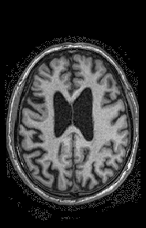 |  | 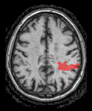 | 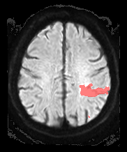 | 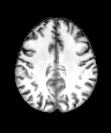 |

```bash
SYNcro \
  tutorial/sub-101_T1w.nii.gz \
  tutorial/sub-101_space-TRACE_desc-lesion_mask.nii.gz \
  tutorial/sub-101_rec-TRACE_dwi.nii.gz \
  --directory outputs/traceAndT1
```

### TRACE only

This example provides only the low-resolution diffusion TRACE scan and its lesion map. SYNcro creates a synthetic T1-weighted image from the TRACE scan and uses it to normalize both inputs to the MNI152 template.

| Input: TRACE with lesion | Output: normalized TRACE with lesion | Output: normalized synthetic T1w |
| --- | --- | --- |
| 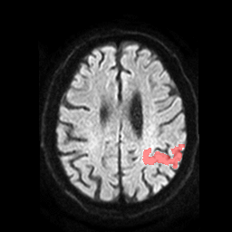 | 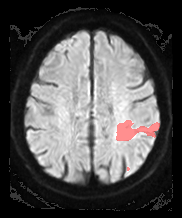 | 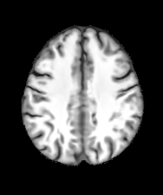 |

```bash
SYNcro \
  tutorial/sub-101_rec-TRACE_dwi.nii.gz \
  tutorial/sub-101_space-TRACE_desc-lesion_mask.nii.gz \
  --directory outputs/traceOnly
```

### T1w only

This example provides a T1-weighted scan and a lesion map drawn in the same image space. SYNcro creates a more uniform synthetic T1-weighted image, uses it to estimate the normalization, and applies that normalization to both inputs.

| Input: T1w with lesion | Output: normalized T1w with lesion | Output: normalized synthetic T1w |
| --- | --- | --- |
| 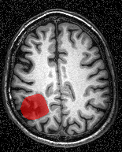 | 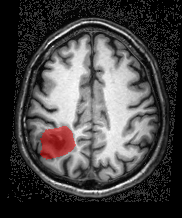 | 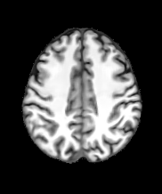 |

```bash
SYNcro \
  tutorial/T1w.nii.gz \
  tutorial/T1w-lesion.nii.gz \
  --directory outputs/t1Only
```

### CT only

This example provides a CT scan and a lesion map drawn in the same image space. The `--ct` option tells SynthSR that the input intensities are Hounsfield units, allowing it to process the CT appropriately.

| Input: CT with lesion | Output: normalized CT with lesion | Output: normalized synthetic T1w |
| --- | --- | --- |
| 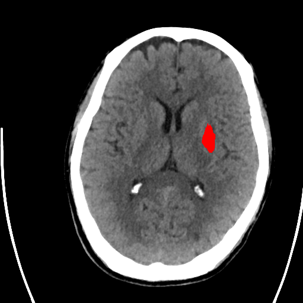 | 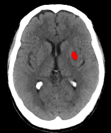 | 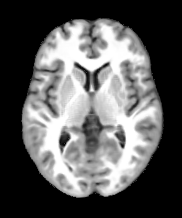 |

```bash
SYNcro \
  tutorial/CT.nii.gz \
  tutorial/CT-lesion.nii.gz \
  --directory outputs/ctOnly \
  --ct --keep-synth
```

This example also demonstrates the `--keep-synth` option. It retains the T1-weighted scan created by SynthSR before brain extraction and spatial normalization. This image includes scalp signal and can be inspected or analyzed with tools designed for whole-head T1-weighted scans, such as brain-age methods. The command therefore generates five outputs:

- `wCT.nii.gz`: normalized input CT image
- `wbCT.nii.gz`: normalized, brain-extracted input CT image
- `wCT-lesion.nii.gz`: normalized lesion image
- `t1CT.nii.gz`: synthesized T1-weighted scan before spatial normalization
- `wbt1CT.nii.gz`: normalized, brain-extracted synthetic T1-weighted scan

## References

- [SynthSR](https://pubmed.ncbi.nlm.nih.gov/36724222/)
- [MindGrab](https://pubmed.ncbi.nlm.nih.gov/42331200/)
- [Greedy registration](https://github.com/pyushkevich/greedy)
- [niimath](https://github.com/rordenlab/niimath)
- The `sub-101` images come from the [Stroke Outcome Optimization Project
(SOOP)](https://pubmed.ncbi.nlm.nih.gov/39095364/).
- The `T1` and `T2` scans come from the [clinical toolbox](https://github.com/neurolabusc/Clinical).
- The `CT` image is from the [acute ischemic stroke dataset](https://github.com/GriffinLiang/AISD).
- The MNI152 template is from the [McConnell Brain Imaging Centre](https://www.bic.mni.mcgill.ca/ServicesAtlases/ICBM152NLin2009).
